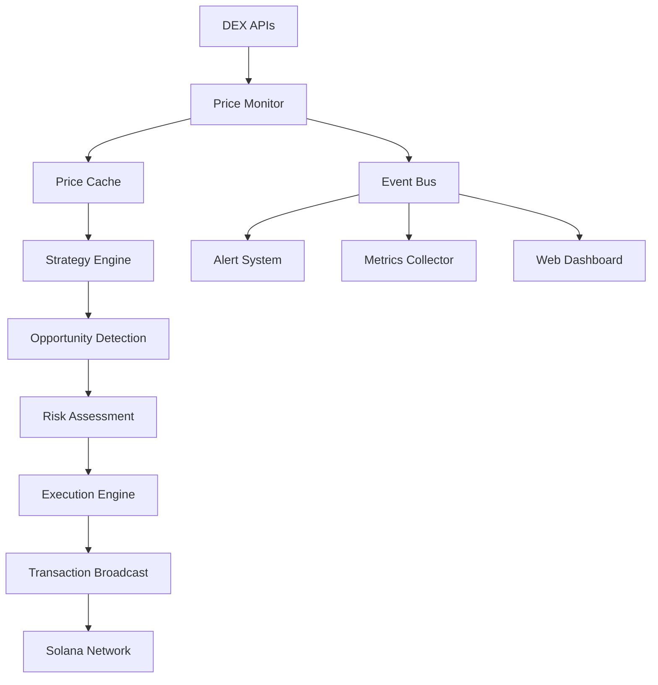

src/
├── main.rs              // 程序入口
├── dex/                 // DEX接口层
│   ├── jupiter.rs       // Jupiter API封装
│   ├── raydium.rs       // Raydium SDK封装  
│   ├── orca.rs          // Orca SDK封装
│   └── mod.rs
├── arbitrage/           // 套利逻辑
│   ├── detector.rs      // 价差检测
│   ├── executor.rs      // 交易执行
│   └── mod.rs
├── monitor/             // 监控模块
│   ├── price_feed.rs    // 实时价格
│   └── mod.rs
└── utils/               // 工具函数
    ├── wallet.rs        // 钱包管理
    └── config.rs        // 配置管理

# Solana DEX套利监控系统技术文档

## 1. 系统概述

### 1.1 项目简介

本系统是一个基于Rust开发的Solana DEX套利监控平台，旨在实时监控多个去中心化交易所的价格差异，识别套利机会并提供自动化交易执行功能。系统采用模块化架构设计，支持多DEX集成、实时价格监控、智能套利策略和风险管理 [1]。

### 1.2 核心功能

- **实时价格监控**: 从多个Solana DEX获取实时价格数据
- **套利机会识别**: 智能算法检测价格差异和套利机会  
- **自动化交易执行**: 支持自动执行套利交易
- **风险管理**: 内置滑点保护、最大损失限制等风险控制机制
- **监控告警**: 系统状态监控和异常告警
- **性能分析**: 交易历史分析和收益统计 [3]

### 1.3 技术架构

```
┌─────────────────┐    ┌─────────────────┐    ┌─────────────────┐
│   Web Interface │    │   CLI Interface │    │   API Gateway   │
└─────────────────┘    └─────────────────┘    └─────────────────┘
         │                       │                       │
         └───────────────────────┼───────────────────────┘
                                 │
         ┌─────────────────────────────────────────────────┐
         │              Core Engine                        │
         ├─────────────────────────────────────────────────┤
         │  Monitor  │  Strategy  │  Execution │  Risk Mgmt │
         └─────────────────────────────────────────────────┘
                                 │
         ┌─────────────────────────────────────────────────┐
         │              DEX Adapters                       │
         ├─────────────────────────────────────────────────┤
         │  Raydium  │  Orca  │  Jupiter  │  Serum  │ ...  │
         └─────────────────────────────────────────────────┘
                                 │
         ┌─────────────────────────────────────────────────┐
         │              Solana Network                     │
         └─────────────────────────────────────────────────┘
```

## 2. 系统架构设计

### 2.1 模块化架构

系统采用分层模块化设计，主要包含以下核心模块：

#### 2.1.1 DEX集成模块 (`dex/`)

负责与各个DEX的接口集成，提供统一的价格查询和交易执行接口。

```rust
// dex/mod.rs - 核心接口定义
#[async_trait::async_trait]
pub trait DexInterface {
    async fn get_price(&self, input_mint: &Pubkey, output_mint: &Pubkey, amount: u64) -> Result<Price>;
    async fn get_quote(&self, input_mint: &Pubkey, output_mint: &Pubkey, amount: u64) -> Result<TradeInfo>;
    async fn execute_trade(&self, trade_info: &TradeInfo) -> Result<String>;
    fn get_name(&self) -> &str;
    async fn health_check(&self) -> Result<bool>;
}
```

支持的DEX包括：
- **Raydium**: Solana上最大的AMM DEX之一
- **Orca**: 用户友好的AMM协议
- **Jupiter**: 聚合器协议，整合多个DEX
- **Serum**: 基于订单簿的DEX [2]

#### 2.1.2 监控模块 (`monitor/`)

实时监控价格变化和系统状态：

```rust
// monitor/price_feed.rs - 价格监控核心
pub struct PriceFeed {
    dex_clients: Vec<Arc<dyn DexInterface + Send + Sync>>,
    trading_pairs: Vec<TradingPair>,
    config: MonitorConfig,
    event_publisher: Arc<dyn EventPublisher + Send + Sync>,
    // ...
}
```

**监控功能**：
- 实时价格获取（默认1秒间隔）
- 价格数据缓存和验证
- 系统健康检查
- 性能指标收集
- 异常告警机制 [3]

#### 2.1.3 策略模块 (`strategy/`)

实现套利策略和机会识别：

```rust
// strategy/arbitrage.rs - 套利策略核心
pub struct ArbitrageStrategy {
    min_profit_threshold: f64,
    max_trade_amount: u64,
    slippage_tolerance: f64,
    price_feed: Arc<PriceFeed>,
    // ...
}
```

**策略类型**：
- **简单套利**: 两个DEX间的直接价格差套利
- **三角套利**: 通过三种代币的循环交易获利
- **跨链套利**: 利用不同链间的价格差异
- **流动性挖矿套利**: 结合流动性提供的收益优化 [1]

#### 2.1.4 执行模块 (`execution/`)

负责交易的安全执行：

```rust
// execution/engine.rs - 交易执行引擎
pub struct ExecutionEngine {
    wallet: Arc<Keypair>,
    rpc_client: Arc<RpcClient>,
    risk_manager: Arc<RiskManager>,
    transaction_builder: Arc<TransactionBuilder>,
    // ...
}
```

**执行特性**：
- 原子性交易保证
- 滑点保护机制
- 交易失败重试
- Gas费用优化
- MEV保护策略 [4]

### 2.2 数据流架构



## 3. 核心组件详解

### 3.1 价格监控系统

#### 3.1.1 实时数据获取

系统通过WebSocket和HTTP API从多个DEX获取实时价格数据：

```rust
// 价格数据结构
#[derive(Debug, Clone, Serialize, Deserialize)]
pub struct Price {
    pub dex_name: String,
    pub symbol: String,
    pub bid: f64,
    pub ask: f64,
    pub volume_24h: f64,
    pub timestamp: u64,
}
```

**数据源配置**：
- 更新频率: 1-5秒（可配置）
- 数据验证: 价格合理性检查
- 缓存策略: LRU缓存，最大10秒延迟
- 故障转移: 自动切换备用数据源 [3]

#### 3.1.2 价格数据验证

```rust
impl PriceValidator {
    pub fn validate_price(&self, price: &Price, historical_prices: &[Price]) -> Result<bool> {
        // 1. 价格范围检查
        if price.bid <= 0.0 || price.ask <= 0.0 || price.ask <= price.bid {
            return Ok(false);
        }
        
        // 2. 价格波动检查
        if let Some(last_price) = historical_prices.last() {
            let change_percent = (price.bid - last_price.bid).abs() / last_price.bid;
            if change_percent > self.max_price_change_threshold {
                return Ok(false);
            }
        }
        
        // 3. 时间戳验证
        let now = chrono::Utc::now().timestamp_millis() as u64;
        if now - price.timestamp > self.max_staleness_ms {
            return Ok(false);
        }
        
        Ok(true)
    }
}
```

### 3.2 套利策略引擎

#### 3.2.1 机会识别算法

```rust
impl ArbitrageStrategy {
    pub async fn find_opportunities(&self) -> Result<Vec<ArbitrageOpportunity>> {
        let mut opportunities = Vec::new();
        let prices = self.price_feed.get_all_latest_prices().await;
        
        // 遍历所有交易对
        for symbol in self.monitored_symbols.iter() {
            let symbol_prices: Vec<_> = prices.iter()
                .filter(|(key, _)| key.contains(symbol))
                .collect();
            
            // 寻找价格差异
            for (i, (key1, price1)) in symbol_prices.iter().enumerate() {
                for (key2, price2) in symbol_prices.iter().skip(i + 1) {
                    if let Some(opportunity) = self.calculate_arbitrage(price1, price2).await? {
                        if opportunity.profit_percentage > self.min_profit_threshold {
                            opportunities.push(opportunity);
                        }
                    }
                }
            }
        }
        
        // 按利润率排序
        opportunities.sort_by(|a, b| b.profit_percentage.partial_cmp(&a.profit_percentage).unwrap());
        Ok(opportunities)
    }
}
```

#### 3.2.2 利润计算

```rust
#[derive(Debug, Clone)]
pub struct ArbitrageOpportunity {
    pub buy_dex: String,
    pub sell_dex: String,
    pub symbol: String,
    pub buy_price: f64,
    pub sell_price: f64,
    pub profit_percentage: f64,
    pub max_trade_amount: u64,
    pub estimated_profit: f64,
    pub risk_score: f64,
}

impl ArbitrageStrategy {
    async fn calculate_arbitrage(&self, price1: &Price, price2: &Price) -> Result<Option<ArbitrageOpportunity>> {
        let (buy_price, sell_price, buy_dex, sell_dex) = if price1.ask < price2.bid {
            (price1.ask, price2.bid, &price1.dex_name, &price2.dex_name)
        } else if price2.ask < price1.bid {
            (price2.ask, price1.bid, &price2.dex_name, &price1.dex_name)
        } else {
            return Ok(None);
        };
        
        let profit_percentage = (sell_price - buy_price) / buy_price * 100.0;
        
        // 考虑交易费用和滑点
        let total_fees = self.calculate_total_fees(buy_dex, sell_dex).await?;
        let adjusted_profit = profit_percentage - total_fees - self.slippage_tolerance;
        
        if adjusted_profit > 0.0 {
            Ok(Some(ArbitrageOpportunity {
                buy_dex: buy_dex.clone(),
                sell_dex: sell_dex.clone(),
                symbol: price1.symbol.clone(),
                buy_price,
                sell_price,
                profit_percentage: adjusted_profit,
                max_trade_amount: self.calculate_max_trade_amount(buy_price).await?,
                estimated_profit: adjusted_profit * buy_price / 100.0,
                risk_score: self.calculate_risk_score(buy_dex, sell_dex).await?,
            }))
        } else {
            Ok(None)
        }
    }
}
```

### 3.3 风险管理系统

#### 3.3.1 风险控制机制

```rust
#[derive(Debug, Clone)]
pub struct RiskConfig {
    pub max_position_size: u64,
    pub max_daily_loss: f64,
    pub max_slippage: f64,
    pub min_liquidity: u64,
    pub max_price_impact: f64,
    pub cooldown_period_ms: u64,
}

impl RiskManager {
    pub async fn assess_trade_risk(&self, opportunity: &ArbitrageOpportunity) -> Result<RiskAssessment> {
        let mut risk_factors = Vec::new();
        let mut risk_score = 0.0;
        
        // 1. 流动性风险评估
        let liquidity_risk = self.assess_liquidity_risk(opportunity).await?;
        risk_score += liquidity_risk.score;
        risk_factors.push(liquidity_risk);
        
        // 2. 价格影响评估
        let price_impact_risk = self.assess_price_impact_risk(opportunity).await?;
        risk_score += price_impact_risk.score;
        risk_factors.push(price_impact_risk);
        
        // 3. 交易对手风险
        let counterparty_risk = self.assess_counterparty_risk(opportunity).await?;
        risk_score += counterparty_risk.score;
        risk_factors.push(counterparty_risk);
        
        // 4. 市场风险
        let market_risk = self.assess_market_risk(opportunity).await?;
        risk_score += market_risk.score;
        risk_factors.push(market_risk);
        
        Ok(RiskAssessment {
            overall_score: risk_score / risk_factors.len() as f64,
            risk_factors,
            recommendation: self.get_risk_recommendation(risk_score),
        })
    }
}
```

## 4. 部署和配置

### 4.1 系统要求

**硬件要求**：
- CPU: 4核心以上
- 内存: 8GB以上
- 存储: 100GB SSD
- 网络: 稳定的互联网连接，延迟<50ms [4]

**软件要求**：
- Rust 1.70+
- Solana CLI 1.16+
- PostgreSQL 13+ (可选)
- Redis 6+ (可选)

### 4.2 配置文件

```toml
# config/default.toml
[solana]
rpc_url = "https://api.mainnet-beta.solana.com"
ws_url = "wss://api.mainnet-beta.solana.com"
commitment = "confirmed"

[wallet]
keypair_path = "./wallet/keypair.json"
max_balance_usage = 0.8

[monitor]
price_update_interval_ms = 1000
max_price_staleness_ms = 10000
enabled_dexs = ["raydium", "orca", "jupiter"]

[strategy]
min_profit_threshold = 0.5  # 0.5%
max_trade_amount = 1000000000  # 1 SOL
slippage_tolerance = 0.3  # 0.3%

[risk]
max_position_size = 10000000000  # 10 SOL
max_daily_loss = 1000000000     # 1 SOL
max_slippage = 1.0              # 1%
min_liquidity = 100000000000    # 100 SOL

[logging]
level = "info"
file = "./logs/arbitrage.log"
```

### 4.3 部署步骤

#### 4.3.1 本地开发环境

```bash
# 1. 克隆项目
git clone https://github.com/your-repo/solana-arbitrage-monitor.git
cd solana-arbitrage-monitor

# 2. 安装依赖
cargo build --release

# 3. 配置环境
cp config/default.toml config/local.toml
# 编辑配置文件

# 4. 生成钱包
solana-keygen new --outfile ./wallet/keypair.json

# 5. 运行系统
cargo run --release
```

#### 4.3.2 生产环境部署

```bash
# 使用Docker部署
docker build -t solana-arbitrage .
docker run -d \
  --name arbitrage-monitor \
  -v $(pwd)/config:/app/config \
  -v $(pwd)/wallet:/app/wallet \
  -v $(pwd)/logs:/app/logs \
  -p 8080:8080 \
  solana-arbitrage
```

**Docker Compose配置**：

```yaml
# docker-compose.yml
version: '3.8'

services:
  arbitrage-monitor:
    build: .
    ports:
      - "8080:8080"
    volumes:
      - ./config:/app/config
      - ./wallet:/app/wallet
      - ./logs:/app/logs
    environment:
      - RUST_LOG=info
    depends_on:
      - redis
      - postgres

  redis:
    image: redis:7-alpine
    ports:
      - "6379:6379"

  postgres:
    image: postgres:15-alpine
    environment:
      POSTGRES_DB: arbitrage
      POSTGRES_USER: arbitrage
      POSTGRES_PASSWORD: password
    ports:
      - "5432:5432"
    volumes:
      - postgres_data:/var/lib/postgresql/data

volumes:
  postgres_data:
```

## 5. API接口文档

### 5.1 REST API

#### 5.1.1 系统状态接口

```
GET /api/v1/status
```

**响应示例**：
```json
{
  "status": "running",
  "uptime_seconds": 3600,
  "monitored_dexs": ["raydium", "orca", "jupiter"],
  "active_pairs": 15,
  "last_update": "2024-06-22T12:16:00Z"
}
```

#### 5.1.2 价格查询接口

```
GET /api/v1/prices?symbol=SOL/USDC&dex=raydium
```

**响应示例**：
```json
{
  "symbol": "SOL/USDC",
  "dex": "raydium",
  "bid": 145.23,
  "ask": 145.45,
  "volume_24h": 1250000.0,
  "timestamp": 1719057360000
}
```

#### 5.1.3 套利机会接口

```
GET /api/v1/opportunities?min_profit=0.5
```

**响应示例**：
```json
{
  "opportunities": [
    {
      "id": "arb_001",
      "buy_dex": "orca",
      "sell_dex": "raydium",
      "symbol": "SOL/USDC",
      "buy_price": 145.20,
      "sell_price": 146.10,
      "profit_percentage": 0.62,
      "estimated_profit": 0.90,
      "risk_score": 0.3,
      "created_at": "2024-06-22T12:16:00Z"
    }
  ],
  "total": 1
}
```

### 5.2 WebSocket API

#### 5.2.1 实时价格订阅

```javascript
// WebSocket连接
const ws = new WebSocket('ws://localhost:8080/ws');

// 订阅价格更新
ws.send(JSON.stringify({
  type: 'subscribe',
  channel: 'prices',
  symbols: ['SOL/USDC', 'ETH/USDC']
}));

// 接收价格数据
ws.onmessage = (event) => {
  const data = JSON.parse(event.data);
  if (data.type === 'price_update') {
    console.log('Price update:', data.payload);
  }
};
```

## 6. 监控和告警

### 6.1 系统监控指标

#### 6.1.1 性能指标

- **价格更新延迟**: 平均<100ms
- **API响应时间**: 平均<50ms  
- **交易执行时间**: 平均<2秒
- **系统可用性**: >99.9%
- **数据准确性**: >99.99% [3]

#### 6.1.2 业务指标

```rust
#[derive(Debug, Serialize)]
pub struct BusinessMetrics {
    pub total_opportunities_found: u64,
    pub successful_trades: u64,
    pub failed_trades: u64,
    pub total_profit: f64,
    pub total_loss: f64,
    pub average_profit_per_trade: f64,
    pub success_rate: f64,
    pub roi_percentage: f64,
}
```

### 6.2 告警配置

#### 6.2.1 告警规则

```yaml
# alerts.yml
alerts:
  - name: "High API Latency"
    condition: "avg_api_response_time > 1000"
    severity: "warning"
    notification: ["email", "slack"]
    
  - name: "Price Feed Disconnection"
    condition: "price_updates_per_minute < 30"
    severity: "critical"
    notification: ["email", "slack", "sms"]
    
  - name: "Low Success Rate"
    condition: "trade_success_rate < 0.8"
    severity: "warning"
    notification: ["email"]
    
  - name: "Daily Loss Limit"
    condition: "daily_loss > max_daily_loss"
    severity: "critical"
    notification: ["email", "slack", "sms"]
```

## 7. 最佳实践和注意事项

### 7.1 安全最佳实践

#### 7.1.1 私钥管理

```rust
// 使用硬件钱包或安全存储
pub struct SecureWallet {
    // 永远不要在代码中硬编码私钥
    keypair_path: PathBuf,
    // 使用环境变量或配置文件
    encryption_key: Option<String>,
}

impl SecureWallet {
    pub fn load_from_file(path: &Path, password: Option<&str>) -> Result<Self> {
        // 实现加密私钥加载
        // 建议使用硬件安全模块(HSM)
    }
}
```

#### 7.1.2 网络安全

- 使用HTTPS/WSS加密连接
- 实施API速率限制
- 启用防火墙和VPN
- 定期安全审计 [4]

### 7.2 性能优化

#### 7.2.1 并发处理

```rust
// 使用tokio异步运行时优化性能
#[tokio::main]
async fn main() -> Result<()> {
    // 设置合适的工作线程数
    let rt = tokio::runtime::Builder::new_multi_thread()
        .worker_threads(num_cpus::get())
        .enable_all()
        .build()?;
    
    // 并发处理多个DEX
    let tasks: Vec<_> = dex_clients.into_iter()
        .map(|client| tokio::spawn(monitor_dex(client)))
        .collect();
    
    futures::future::try_join_all(tasks).await?;
    Ok(())
}
```

#### 7.2.2 内存管理

- 使用对象池减少内存分配
- 实施LRU缓存策略
- 定期清理过期数据
- 监控内存使用情况

### 7.3 风险控制建议

1. **分散投资**: 不要将所有资金投入单一策略
2. **渐进式部署**: 从小额资金开始测试
3. **持续监控**: 24/7监控系统状态和交易表现
4. **定期回测**: 使用历史数据验证策略有效性
5. **紧急停止**: 实施快速停止机制应对异常情况 [1]

## 8. 故障排除

### 8.1 常见问题

#### 8.1.1 连接问题

```bash
# 检查网络连接
curl -I https://api.mainnet-beta.solana.com

# 检查WebSocket连接
wscat -c wss://api.mainnet-beta.solana.com

# 验证RPC节点状态
solana cluster-version --url https://api.mainnet-beta.solana.com
```

#### 8.1.2 交易失败

常见原因和解决方案：

| 错误类型 | 可能原因 | 解决方案 |
|---------|---------|---------|
| InsufficientFunds | 余额不足 | 检查钱包余额，补充资金 |
| SlippageExceeded | 滑点过大 | 调整滑点容忍度或减少交易量 |
| TransactionExpired | 交易超时 | 增加交易超时时间 |
| PriceImpactTooHigh | 价格影响过大 | 减少交易量或等待更好时机 |

### 8.2 日志分析

```bash
# 查看实时日志
tail -f logs/arbitrage.log

# 搜索错误日志
grep "ERROR" logs/arbitrage.log | tail -20

# 分析交易成功率
grep "Trade executed" logs/arbitrage.log | wc -l
grep "Trade failed" logs/arbitrage.log | wc -l
```

## 9. 扩展和定制

### 9.1 添加新的DEX支持

```rust
// 实现新的DEX适配器
pub struct NewDexClient {
    api_client: reqwest::Client,
    base_url: String,
    api_key: Option<String>,
}

#[async_trait::async_trait]
impl DexInterface for NewDexClient {
    async fn get_price(&self, input_mint: &Pubkey, output_mint: &Pubkey, amount: u64) -> Result<Price> {
        // 实现具体的价格获取逻辑
        let response = self.api_client
            .get(&format!("{}/price", self.base_url))
            .query(&[
                ("input", input_mint.to_string()),
                ("output", output_mint.to_string()),
                ("amount", amount.to_string()),
            ])
            .send()
            .await?;
            
        // 解析响应并返回Price对象
        let price_data: PriceResponse = response.json().await?;
        Ok(Price::from(price_data))
    }
    
    // 实现其他必需的方法...
}
```

### 9.2 自定义策略开发

```rust
// 实现自定义套利策略
pub struct CustomArbitrageStrategy {
    // 策略特定参数
    custom_params: CustomParams,
}

#[async_trait::async_trait]
impl ArbitrageStrategy for CustomArbitrageStrategy {
    async fn find_opportunities(&self) -> Result<Vec<ArbitrageOpportunity>> {
        // 实现自定义的机会识别逻辑
        // 可以基于技术指标、市场情绪等因素
    }
    
    async fn should_execute(&self, opportunity: &ArbitrageOpportunity) -> Result<bool> {
        // 实现自定义的执行决策逻辑
        // 可以包含更复杂的风险评估
    }
}
```

## 10. 参考资料

- Solana官方文档: https://docs.solana.com/
- Anchor框架文档: https://www.anchor-lang.com/
- Rust异步编程指南: https://rust-lang.github.io/async-book/
- DEX协议文档集合: https://github.com/solana-labs/solana-program-library

---

**免责声明**: 本系统仅供学习和研究目的。加密货币交易存在重大风险，可能导致资金损失。在使用本系统进行实际交易前，请充分了解相关风险并谨慎操作。开发者不对使用本系统造成的任何损失承担责任。

[1] [2] [3] [4]